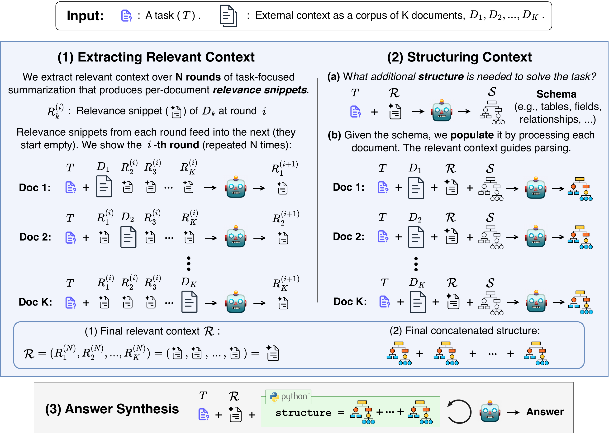

# r3con

**Reasoning over a corpus of documents — by building the right representation first.**

Ask a question whose evidence is scattered across many documents. `r3con` doesn't answer it
with a fixed pipeline: it constructs a representation *for that question*, then reasons over it.



## Install

```bash
pip install r3context
```

Installs as `r3context`, imports as `r3con` — the PyPI name was taken, the code's name wasn't.

## Use

```bash
r3con run "Which supplier missed the most delivery windows?" ./reports
```

```python
from r3con import r3con

docs = r3con.read_documents("./reports")   # a folder, a glob, or a list of files
result = r3con.run("Which supplier missed the most delivery windows?", docs)

print(result)              # the answer
result.relevance           # what each document was found to contribute
result.struct_data         # the structured records, each tagged with its source document
result.schema_code         # the schema proposed for this question
result.run_dir             # where the full artifacts were written
```

`documents` is a **list of strings** — the documents themselves. `read_documents` is the
separate, explicit way to read them off disk, so nothing has to guess what you meant.

## The three phases

1. **Extracting relevant context.** Relevance isn't a property a document *has* — a passage
   that looks irrelevant alone can become the missing link once you know what the other
   documents say. So every document is read against your question into a **relevance
   snippet**, then re-read over `N` rounds given the *other* documents' snippets. A document
   never sees its own previous snippet, so it can be reinterpreted from scratch.
2. **Structuring.** A schema is proposed *for this question*, from the task and the relevance
   snippets — the model picks both the semantic organization and the data structure. Every
   document is then parsed into it, with the relevance snippets as the context that resolves
   ambiguities.
3. **Answer synthesis.** The structured data is placed in a sandboxed Python REPL and a coding
   agent reasons over it together with the relevance snippets, until it commits an answer.

Nothing is chunked, and the corpus is never put in one prompt: documents are read one at a
time, and information crosses between them through the relevance snippets.

## Configuration

Everything that shapes the answer — model, seed, rounds, prompt versions, generation params —
lives in one run config, and its label is the identity of a run:

```
default[model=gpt-5.6-luna,seed=42,rounds=2,prompts=(rel=v1,schema=v1,parse=v1,reason=v1)]
```

```bash
r3con run "..." ./docs --model anthropic/claude-sonnet-4 --relevance-rounds 3
```

## Connecting to a model

`r3con` calls [litellm](https://docs.litellm.ai) directly, so set the variable your provider
already expects (`OPENAI_API_KEY`, `ANTHROPIC_API_KEY`, …) — a `.env` in your working directory
is loaded for you — and pass its model string. `--base-url` points at a self-hosted endpoint.
There is no r3con-branded key variable and no model registry.

If you already own the connection, hand it over — anything with litellm's
`(model, messages, **kwargs)` shape works:

```python
r3con.run("...", docs, model="my-group", completion=router.completion)
```

Generation parameters go in one place, passed straight through:
`r3con.run("...", docs, params={"temperature": 0.7})`.

## What it leaves behind

Every run writes a folder under `./logs` containing exactly what it did — each document's
relevance snippet in each round, the proposed schema and any repair attempts, the parsed
records, and the full reasoning transcript. The answer alone rarely tells you whether to
trust it; these do.

```
logs/<timestamp>_<hex>/
├── relevance/            result.json · calls.json
├── structuring/
│   ├── schema/           result.json · calls.json · transcript.yaml
│   └── parsing/          result.json · calls.json
└── reasoning/            result.json · calls.json · transcript.yaml
```

`examples/quickstart.ipynb` runs the whole thing over five short memos arranged so no single
one holds the answer.

## Security: this runs model-generated code

Phase 2 `exec`s the proposed schema in-process to validate it — no sandbox. Phase 3 runs the
agent's code in a restricted AST interpreter with an import allowlist, blocked dunder access,
and operation/loop/time caps, which raises the bar but is not a boundary to bet a production
secret on. Both are conditioned on your documents' contents, so treat documents as untrusted
input and prefer a container for anything sensitive.

## Licence

MIT — see [LICENSE](LICENSE). `src/r3con/runtime/python_executor.py` is a modified copy of the
sandboxed interpreter from [smolagents](https://github.com/huggingface/smolagents), Apache-2.0,
© HuggingFace Inc. See [NOTICE](NOTICE) and [LICENSE-APACHE-2.0](LICENSE-APACHE-2.0).
